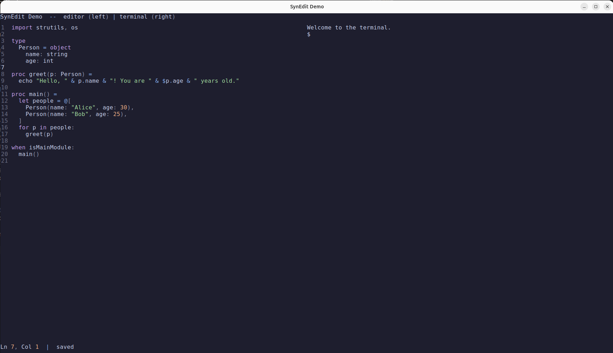

# uirelays

Native Nim UI library based on the idea of "relays" -- dependency injection
via global callbacks. Has Windows API, X11, Cocoa, GTK4, SDL2 and SDL3
support. Write UI apps as easily as terminal apps!



## Getting started

`import uirelays` is all you need -- it re-exports everything and
automatically initializes the native backend for the current platform
(WinAPI on Windows, Cocoa on macOS, X11 on Linux/BSD). Override with
`-d:sdl3`, `-d:sdl2`, or `-d:gtk4`.

For finer control, import the submodules directly and call `initBackend()`
yourself:

```nim
import uirelays/[coords, screen, input, backend]
initBackend()
```

## Installation

Install this package with Nimble:

```sh
nimble install
```

Backend selection:

- Default on Windows: WinAPI
- Default on macOS: Cocoa
- Default on Linux/BSD: X11
- Optional overrides: `-d:gtk4`, `-d:sdl3`, `-d:sdl2`

### Nim Packages For SDL Backends

The SDL backends need extra Nim packages in addition to the native system
libraries:

```sh
nimble install https://github.com/nim-lang/sdl3
nimble install https://github.com/nim-lang/sdl2
```

Install `sdl3` when building with `-d:sdl3`. Install `sdl2` when building
with `-d:sdl2`.

### Linux

Choose the backend you want and install its native development packages.

#### Ubuntu

Default X11 backend:

```sh
sudo apt install libx11-dev libxft-dev
```

GTK4 backend:

```sh
sudo apt install libgtk-4-dev libpango1.0-dev libcairo2-dev libfontconfig1-dev libglib2.0-dev pkg-config
```

SDL3 backend:

```sh
sudo apt install libsdl3-dev libsdl3-ttf-dev
nimble install https://github.com/nim-lang/sdl3
```

SDL2 backend:

```sh
sudo apt install libsdl2-dev libsdl2-ttf-dev
nimble install https://github.com/nim-lang/sdl2
```

#### Fedora

Default X11 backend:

```sh
sudo dnf install libX11-devel libXft-devel
```

GTK4 backend:

```sh
sudo dnf install gtk4-devel pango-devel cairo-devel fontconfig-devel glib2-devel pkgconf-pkg-config
```

SDL3 backend:

```sh
sudo dnf install SDL3-devel SDL3_ttf-devel
nimble install https://github.com/nim-lang/sdl3
```

SDL2 backend:

```sh
sudo dnf install SDL2-devel SDL2_ttf-devel
nimble install https://github.com/nim-lang/sdl2
```

### macOS

The default Cocoa backend needs no extra native libraries.

```sh
nim c examples/hello.nim
```

For SDL backends on macOS, install the SDL libraries with your preferred
package manager, then install the matching Nim package:

```sh
nimble install https://github.com/nim-lang/sdl3
nimble install https://github.com/nim-lang/sdl2
```

### Windows

The default WinAPI backend needs no extra native libraries.

```sh
nim c examples/hello.nim
```

For SDL backends on Windows, install the SDL native libraries separately
and then install the matching Nim package:

```sh
nimble install https://github.com/nim-lang/sdl3
nimble install https://github.com/nim-lang/sdl2
```

### Build Examples

Use the default backend for your platform:

```sh
nim c examples/hello.nim
```

Force a specific backend:

```sh
nim c -d:gtk4 examples/hello.nim
nim c -d:sdl3 examples/hello.nim
nim c -d:sdl2 examples/hello.nim
```

## Examples

- [editor.nim](examples/editor.nim) -- Code editor with integrated terminal
- [hello.nim](examples/hello.nim) -- Minimal window with text rendering
- [paint.nim](examples/paint.nim) -- Simple drawing app with explicit submodule imports
- [layout_demo.nim](examples/layout_demo.nim) -- Markdown table layout system demo
- [todo.nim](examples/todo.nim) -- Todo list app

## Architecture

The library is split into five relay groups:

| Module | Relays | Purpose |
|--------|--------|---------|
| `screen` | `windowRelays` | Window lifecycle, cursor, clip rect |
| `screen` | `fontRelays` | Font loading, text measurement and rendering |
| `screen` | `drawRelays` | Rectangles, lines, points, images |
| `input` | `inputRelays` | Events, timing, shutdown |
| `input` | `clipboardRelays` | Copy/paste |

Drivers populate these relay objects at init time. Application code calls
convenience wrappers (`fillRect`, `drawText`, `waitEvent`, ...) that
dispatch through the relays. No virtual calls, no inheritance, no heap
allocation -- just plain proc pointers.

## Drivers

| Driver | Platform | Dependencies |
|--------|----------|-------------|
| `winapi_driver` | Windows | None (GDI) |
| `cocoa_driver` | macOS | None (AppKit) |
| `x11_driver` | Linux/BSD | libX11, libXft |
| `gtk4_driver` | Linux/BSD | GTK4, Cairo, Pango |
| `sdl3_driver` | Cross-platform | SDL3, SDL3_ttf |
| `sdl2_driver` | Cross-platform | SDL2, SDL2_ttf |

See [Writing a custom driver](doc/drivers.md) for a guide on
adding support for a new platform or graphics toolkit.

## License

MIT
